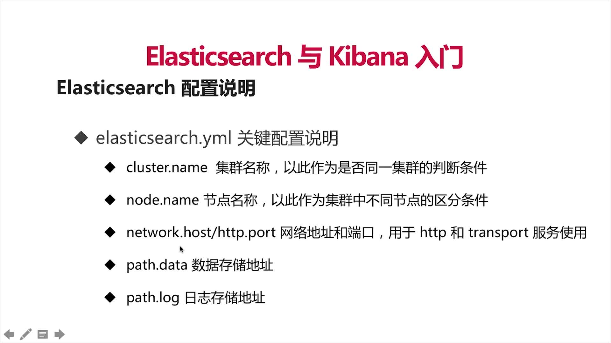
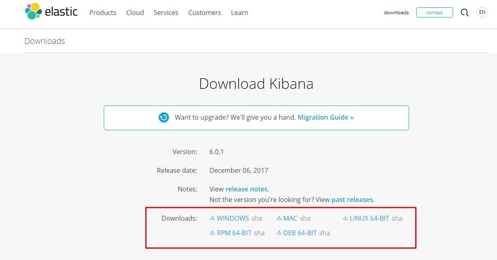

# Elasticsearch

## 前言

> 本是个web开发小生，在之前的公司接触到了Elasticsearch，出于对大数据的好奇，开始了自学，
本文参看了部分博客，慕课网视频，本着对原创敬佩的态度，贴出参考路径...

- 慕课网学习视频 **https://www.imooc.com/learn/920**
- JDK安装 **http://blog.csdn.net/wangkuangs/article/details/54232681**

## 安装/运行

###  1. 初始化

 - 成功安装jdk1.8
 
 - 下载、安装
 
```bash
    wget https://artifacts.elastic.co/downloads/elasticsearch/elasticsearch-5.6.3.tar.gz
    # 解压
    tar -zxvf elasticsearch-5.6.3.tar.gz
```

### 2. 启动

```bash

    # 新建普通用户
     groupadd elasticsearch
     useradd -m elasticsearch -g elasticsearch -d /home/elasticsearch
    
    # 修改密码
     passwd elasticsearch
    
    # 切换普通用户
    su elasticsearch
    
    # 启动
    ./bin/elasticsearch
    
```

### 3. 修改配置

- 基础配置

```bash
vi /usr/local/elasticsearch/config/elasticsearch.yml
```




- 内存配置

```bash
vi ./config/jvm.options

#修改内存配置
-Xms2g
-Xmx2g
```

### 4. 安装插件 

#### elasticsearch-head

- 下载

```bash

git clone https://github.com/mobz/elasticsearch-head.git

# 成功安装node (大于6.0)

# 初始化项目
cd elasticsearch-head
npm install

# 启动
npm run start

```

- 解决跨域问题

```bash
# 修改 elasticsearch.yml, 允许跨域, 在文件末尾添加
http.cors.enabled: true
http.cors.allow-origin: "*"
```

## 快速搭建集群

### 启动

- 启动第一个节点

```bash
./bin/elasticsearch 
```

- 启动第二个节点

```bash
./bin/elasticsearch -Ehttp.port=8200 -Epath.data=node2
```

- 启动第三个节点

```bash
./bin/elasticsearch -Ehttp.port=7200 -Epath.data=node3
```

### 查看

- 查看启动集群状态 **http://localhost:9200/_cat/nodes**

```bash
192.168.1.111 11 97 5 0.22 0.54 0.52 mdi - P6j2v_c
192.168.1.111 13 97 5 0.22 0.54 0.52 mdi - DQOqgiL
192.168.1.111 17 97 5 0.22 0.54 0.52 mdi * JPWkmUG
```


- 集群详情 ： **http://192.168.1.111:9200/_cluster/stats**

```json
{
    "_nodes": {
        "total": 3,
        "successful": 3,
        "failed": 0
    },
    "cluster_name": "elasticsearch",
    "timestamp": 1512828954692,
    "status": "green",
    "indices": {
        "count": 2,
        "shards": {
            "total": 16,
            "primaries": 8,
            "replication": 1,
            "index": {
                "shards": {
                    "min": 6,
                    "max": 10,
                    "avg": 8
                },
                "primaries": {
                    "min": 3,
                    "max": 5,
                    "avg": 4
                },
                "replication": {
                    "min": 1,
                    "max": 1,
                    "avg": 1
                }
            }
        },
        "docs": {
            "count": 6,
            "deleted": 0
        },
        "store": {
            "size_in_bytes": 59706,
            "throttle_time_in_millis": 0
        },
        "fielddata": {
            "memory_size_in_bytes": 0,
            "evictions": 0
        },
        "query_cache": {
            "memory_size_in_bytes": 0,
            "total_count": 0,
            "hit_count": 0,
            "miss_count": 0,
            "cache_size": 0,
            "cache_count": 0,
            "evictions": 0
        },
        "completion": {
            "size_in_bytes": 0
        },
        "segments": {
            "count": 12,
            "memory_in_bytes": 34228,
            "terms_memory_in_bytes": 26796,
            "stored_fields_memory_in_bytes": 3744,
            "term_vectors_memory_in_bytes": 0,
            "norms_memory_in_bytes": 2560,
            "points_memory_in_bytes": 24,
            "doc_values_memory_in_bytes": 1104,
            "index_writer_memory_in_bytes": 0,
            "version_map_memory_in_bytes": 0,
            "fixed_bit_set_memory_in_bytes": 0,
            "max_unsafe_auto_id_timestamp": -1,
            "file_sizes": {}
        }
    },
    "nodes": {
        "count": {
            "total": 3,
            "data": 3,
            "coordinating_only": 0,
            "master": 3,
            "ingest": 3
        },
        "versions": [
            "5.6.2"
        ],
        "os": {
            "available_processors": 6,
            "allocated_processors": 6,
            "names": [
                {
                    "name": "Linux",
                    "count": 3
                }
            ],
            "mem": {
                "total_in_bytes": 11113943040,
                "free_in_bytes": 400244736,
                "used_in_bytes": 10713698304,
                "free_percent": 4,
                "used_percent": 96
            }
        },
        "process": {
            "cpu": {
                "percent": 0
            },
            "open_file_descriptors": {
                "min": 196,
                "max": 204,
                "avg": 199
            }
        },
        "jvm": {
            "max_uptime_in_millis": 1287394,
            "versions": [
                {
                    "version": "1.8.0_144",
                    "vm_name": "Java HotSpot(TM) 64-Bit Server VM",
                    "vm_version": "25.144-b01",
                    "vm_vendor": "Oracle Corporation",
                    "count": 3
                }
            ],
            "mem": {
                "heap_used_in_bytes": 480286304,
                "heap_max_in_bytes": 3168927744
            },
            "threads": 93
        },
        "fs": {
            "total_in_bytes": 484573421568,
            "free_in_bytes": 443235115008,
            "available_in_bytes": 418596622336
        },
        "plugins": [],
        "network_types": {
            "transport_types": {
                "netty4": 3
            },
            "http_types": {
                "netty4": 3
            }
        }
    }
}
```

## 下载安装kibana

### 下载

- 地址**https://www.elastic.co/downloads/kibana**，目前我使用的是**Debian 64位**，根据自己的系统，对应下载。



```bash
wget https://artifacts.elastic.co/downloads/kibana/kibana-6.0.1-linux-x86_64.tar.gz
```

### 修改配置


```bash
vi ./config/kibana.yml

# 修改 elasticsearch 路径地址
elasticsearch.url = 'http://localhost:9200'
```

### 启动

```bash
./bin/kibana -H 0.0.0.0 -p 5601
```

### 功能介绍


## beat

### 介绍


### FileBeat 


### 下载安装

```bash
wget https://artifacts.elastic.co/downloads/beats/filebeat/filebeat-5.6.2-linux-x86_64.tar.gz
```

### 配置运行

#### 配置  **nginx.yml**

```yaml
#=========================== Filebeat prospectors =============================
filebeat.prospectors:
- input_type: stdin
#================================ Outputs =====================================
output.console:
    pretty: true
```

#### 配合**nginx** 日志运行

##### 运行

```bash
head -n 1 /data/wwwlogs/access_nginx.log | ./filebeat -e -c nginx.yml
```

##### 输出

> 原数据 192.168.1.108 - - [10/Dec/2017:21:12:11 +0800] 
"GET / HTTP/1.1" 200 21 "-" "Mozilla/5.0 (Windows NT 6.1; Win64; x64) 
AppleWebKit/537.36 (KHTML, like Gecko) Chrome/62.0.3202.94 Safari/537.36"


```json
{
  "@timestamp": "2017-12-10T13:16:00.964Z",
  "beat": {
    "hostname": "penguinSeven",
    "name": "penguinSeven",
    "version": "5.6.2"
  },
  "input_type": "stdin",
  "message": "192.168.1.108 - - [10/Dec/2017:21:12:11 +0800] \"GET / HTTP/1.1\" 200 21 \"-\" \"Mozilla/5.0 (Windows NT 6.1; Win64; x64) AppleWebKit/537.36 (KHTML, like Gecko) Chrome/62.0.3202.94 Safari/537.36\"",
  "offset": 0,
  "source": "",
  "type": "log"
}

```


## packetbeat

> 实时抓取网络包

### 下载

```bash
wget https://artifacts.elastic.co/downloads/beats/packetbeat/packetbeat-5.6.2-linux-x86_64.tar.gz
```

### 配置运行

#### 配置

```yaml

#============================== Network device ================================

packetbeat.interfaces.device: eth0

packetbeat.protocols.http:
  # Configure the ports where to listen for HTTP traffic. You can disable
  # the HTTP protocol by commenting out the list of ports.
  ports: [9200]
  send_request: true   
  include_body_for: ["application/json", "x-www-form-urlencoded"]


#================================ Outputs =====================================

output.console:
    pretty: true

```

#### 运行

```bash
./packetbeat -e -c es.yml -strict.perms=false
```
#### 输出结果

```json
{
  "@timestamp": "2017-12-10T14:39:10.624Z",
  "beat": {
    "hostname": "penguinSeven",
    "name": "penguinSeven",
    "version": "5.6.2"
  },
  "bytes_in": 1250,
  "bytes_out": 193,
  "client_ip": "192.168.1.108",
  "client_port": 14400,
  "client_proc": "",
  "client_server": "",
  "direction": "in",
  "http": {
    "request": {
      "headers": {
        "content-length": 0
      },
      "params": ""
    },
    "response": {
      "code": 200,
      "headers": {
        "content-length": 89,
        "content-type": "text/plain; charset=UTF-8"
      },
      "phrase": "OK"
    }
  },
  "ip": "192.168.1.111",
  "method": "GET",
  "path": "/_cat/nodes",
  "port": 9200,
  "proc": "",
  "query": "GET /_cat/nodes",
  "request": "GET /_cat/nodes HTTP/1.1\r\nHost: 192.168.1.111:9200\r\nConnection: keep-alive\r\nCache-Control: max-age=0\r\nUser-Agent: Mozilla/5.0 (Windows NT 6.1; Win64; x64) AppleWebKit/537.36 (KHTML, like Gecko) Chrome/62.0.3202.94 Safari/537.36\r\nUpgrade-Insecure-Requests: 1\r\nAccept: text/html,application/xhtml+xml,application/xml;q=0.9,image/webp,image/apng,*/*;q=0.8\r\nAccept-Encoding: gzip, deflate\r\nAccept-Language: zh-CN,zh;q=0.9,en;q=0.8\r\nCookie: _identity-frontend=687c0976b190b7123bf2d7a4bf9065cc490e67a1a4412a819deab9c077217034a%3A2%3A%7Bi%3A0%3Bs%3A18%3A%22_identity-frontend%22%3Bi%3A1%3Bs%3A46%3A%22%5B3%2C%22j5gIPkp6dhRxGUdmbp3yfIihFr64u8IC%22%2C2592000%5D%22%3B%7D; XSRF-TOKEN=eyJpdiI6IlBaVnpucWQxTkRkNk5TWGg2d2RmWFE9PSIsInZhbHVlIjoiMzlqQkM3ZXZqVzF5M2F6Y2JvTDVsRmVGNDNDb2cxQzZRdGIxblFzOHZ6YmlpQUFNdE1MZG5TS0lDYmpcL21sRXhPV0RsM1hrcWlYYTRKNFJlTStWWHlBPT0iLCJtYWMiOiJmOWFjNWIwMWY1OThjMzQyZGQ2NGM4Y2RmZGM1YjM5ZjcxNzZjMGY1MTBkZDRlYzkxNzU4MTJlZDJiZTZlOTQ4In0%3D; laravel_session=eyJpdiI6IktaRFRNTXRkWTBob3Z1bTNFbnp5Z0E9PSIsInZhbHVlIjoiZkdqbngxSXN1eEFoY1d1R1wvMGUwTnBvOUp3VVwvaThUUkZHMXpwOXpTc0Z2cUdFeDhDSFhCZUhPSmpOVUU2MHpGcUxPYWszNmlkNGgxSXE4Rlg0bGZNQT09IiwibWFjIjoiZTFkMWZjNzY2YTgxN2ViMzgwYWE3N2FjM2NjODJkNGVmMWIwNDM0MTAwOTBlOGRiMjBmNzFmNjc2M2RhZDU0OSJ9\r\n\r\n",
  "responsetime": 162,
  "server": "",
  "status": "OK",
  "type": "http"
}
```

## Logstash

### 下载安装

```bash
wget https://artifacts.elastic.co/downloads/logstash/logstash-5.6.2.tar.gz
```

### 配置

```conf
input {
  stdin { }
}

filter {
  grok {
    match => {
      "message" => '%{IPORHOST:remote_ip} - %{DATA:user_name} \[%{HTTPDATE:time}\] "%{WORD:request_action} %{DATA:request} HTTP/%{NUMBER:http_version}" %{NUMBER:response} %{NUMBER:bytes} "%{DATA:referrer}" "%{DATA:agent}"'
    }
  }

  date {
    match => [ "time", "dd/MMM/YYYY:HH:mm:ss Z" ]
    locale => en
  }

  geoip {
    source => "remote_ip"
    target => "geoip"
  }

  useragent {
    source => "agent"
    target => "user_agent"
  }
}

output {
stdout {
 codec => rubydebug 
 }
}

```

### 运行与输出

#### 运行

```bash
head -n 1 /data/wwwlogs/access_nginx.log | ./bin/logstash -f nginx.conf
```

####输出

> 原数据 192.168.1.108 - - [10/Dec/2017:21:12:11 +0800] "GET / HTTP/1.1" 200 21 "-" "Mozilla/5.0 (Windows NT 6.1; Win64; x64) AppleWebKit/537.36 (KHTML, like Gecko) Chrome/62.0.3202.94 Safari/537.36"

```txt
{
           "request" => "/",
    "request_action" => "GET",
             "agent" => "Mozilla/5.0 (Windows NT 6.1; Win64; x64) AppleWebKit/537.36 (KHTML, like Gecko) Chrome/62.0.3202.94 Safari/537.36",
             "geoip" => {},
         "user_name" => "-",
      "http_version" => "1.1",
           "message" => "192.168.1.108 - - [10/Dec/2017:21:12:11 +0800] \"GET / HTTP/1.1\" 200 21 \"-\" \"Mozilla/5.0 (Windows NT 6.1; Win64; x64) AppleWebKit/537.36 (KHTML, like Gecko) Chrome/62.0.3202.94 Safari/537.36\"",
              "tags" => [
        [0] "_geoip_lookup_failure"
    ],
          "referrer" => "-",
        "@timestamp" => 2017-12-10T13:12:11.000Z,
         "remote_ip" => "192.168.1.108",
          "response" => "200",
             "bytes" => "21",
          "@version" => "1",
              "host" => "penguinSeven",
              "time" => "10/Dec/2017:21:12:11 +0800",
        "user_agent" => {
          "patch" => "3202",
             "os" => "Windows 7",
          "major" => "62",
          "minor" => "0",
          "build" => "",
           "name" => "Chrome",
        "os_name" => "Windows 7",
         "device" => "Other"
    }
}

```


## 问题

### 使用问题

### 安装配置问题

- 1、can not run elasticsearch as root 

```bash
# 切换到非root用户
```

- 2、main ERROR Could not register mbeans java.security.AccessControlException: access denied ("javax.management.MBeanTrustPermission" "register")

```bash
# 改变elasticsearch文件夹所有者到当前用户
sudo chown -R noroot:noroot elasticsearch
```

- 3、max virtual memory areas vm.max_map_count [65530] is too low, increase to at least [262144]

```bash
sudo vi /etc/sysctl.conf 
# 添加下面配置：
vm.max_map_count=655360
# 并执行命令：
sudo sysctl -p
```
- 4、max file descriptors [4096] for elasticsearch process is too low, increase to at least [65536]

```bash

sudo vi /etc/security/limits.conf

# 添加如下内容:
* soft nofile 65536
* hard nofile 131072
* soft nproc 2048
* hard nproc 4096

sudo vi /etc/pam.d/common-session
添加 session required pam_limits.so

sudo vi /etc/pam.d/common-session-noninteractive
添加 session required pam_limits.so

```


    
