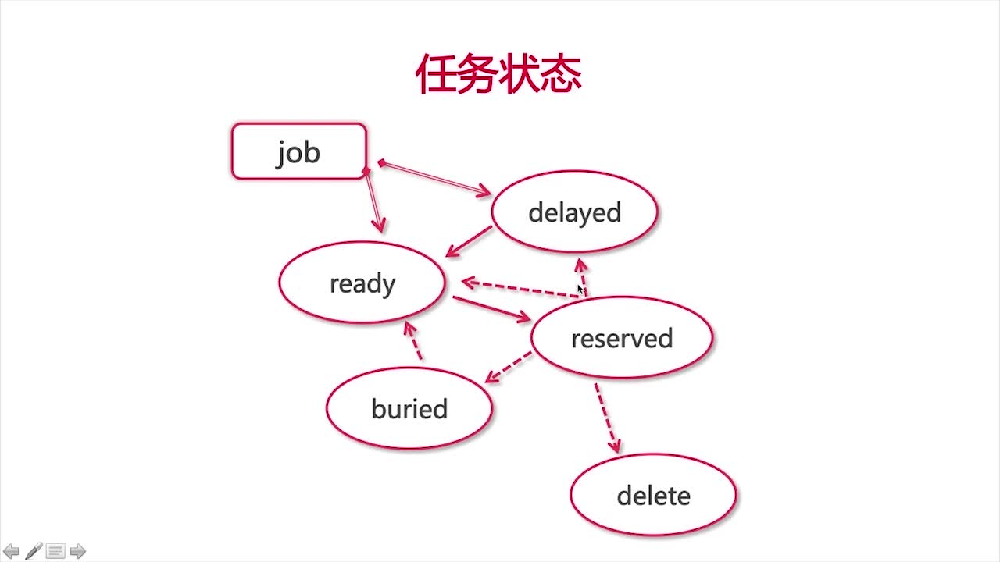

# BeanStalkd

## 介绍

### 任务状态


### 管道与任务


## 安装/运行

### 下载安装

- 包管理工具安装

```bash
apt-get install beanstalkd
```

- 编译安装

```bash

# 下载
git clone https://github.com/kr/beanstalkd 

 #QUICK START

 $ make
 $ ./beanstalkd
 
 
 # also try,
 
 $ ./beanstalkd -h
 $ ./beanstalkd -VVV
 $ make CFLAGS=-O2
 $ make CC=clang
 $ make check
 $ make install
 $ make install PREFIX=/usr
```

## 使用

###  composer 引入pheanStalkd

```bash
$ composer require pda/pheanstalk
```

### 代码实现

```php
<?php
    
    require_once "./vendor/autoload.php";
    
   use Pheanstalk\Pheanstalk;
   
  $pheanstalk = new Pheanstalk("127.0.0.1", "11300");
  
  print_r($pheanstalk->status());
```


- 类、方法清单
    
    - 维护类
        
        - status, 当前beanstalkd的状态信息，`$pheanstalk->status()` 结果分析
        
        ```bash
        Pheanstalk\Response\ArrayResponse Object 
        (
            [_name:Pheanstalk\Response\ArrayResponse:private] => OK
            [storage:ArrayObject:private] => Array
                (
                    # 当前存在优先级的任务数
                    [current-jobs-urgent] => 0
                    
                    # ready 状态的任务数
                    [current-jobs-ready] => 0
                    
                    # reserved 状态的任务数
                    [current-jobs-reserved] => 0
                    
                    # delayed 延时的任务数
                    [current-jobs-delayed] => 0
                    
                    # buried 预留状态的任务数
                    [current-jobs-buried] => 0
                    
                    # cmd-(.*) 运行过 $1 命令的次数
                    [cmd-put] => 0
                    [cmd-peek] => 1
                    [cmd-peek-ready] => 0
                    [cmd-peek-delayed] => 0
                    [cmd-peek-buried] => 0
                    [cmd-reserve] => 0
                    [cmd-reserve-with-timeout] => 0
                    [cmd-delete] => 0
                    [cmd-release] => 0
                    [cmd-use] => 0
                    [cmd-watch] => 0
                    [cmd-ignore] => 0
                    [cmd-bury] => 0
                    [cmd-kick] => 0
                    [cmd-touch] => 0
                    [cmd-stats] => 2
                    [cmd-stats-job] => 0
                    [cmd-stats-tube] => 0
                    [cmd-list-tubes] => 0
                    [cmd-list-tube-used] => 0
                    [cmd-list-tubes-watched] => 0
                    [cmd-pause-tube] => 0
                    
                    # 任务超时被重新放回管道的任务数，理应为0
                    [job-timeouts] => 0
                    
                    # 任务累计数
                    [total-jobs] => 0
                    
                    # 任务大小2^16
                    [max-job-size] => 65535
                    
                    # 当前管道数
                    [current-tubes] => 1
                    
                    # 当前连接数
                    [current-connections] => 1
                    
                    # 当前生产者数，计数方式为至少发送一次put指令，算一个
                    [current-producers] => 0
                    
                    # 当前消费者数，至少发送过reserv指令，算一个
                    [current-workers] => 0
                    
                    # 发送过reserv指令但是没有得到相应的数量
                    [current-waiting] => 0
                    
                    # 累计连接次数
                    [total-connections] => 2
                    
                    # beanstalkd 当前pid
                    [pid] => 613
                    
                    #版本
                    [version] => 1.10
                    
                    # 以下两项反应负载情况，超过1需排查
                    
                    # 记录执行用户代码的时间
                    [rusage-utime] => 0.008000
                    
                    # 记录执行内核代码的时间
                    [rusage-stime] => 0.004000
                    
                    # 运行时间 单位/秒
                    [uptime] => 35319
                    
                    # 不常用
                    [binlog-oldest-index] => 0
                    [binlog-current-index] => 0
                    [binlog-records-migrated] => 0
                    [binlog-records-written] => 0
                    [binlog-max-size] => 10485760
                    [id] => a3da96b14d2abff9
                    [hostname] => penguinSeven
                )
        
        )
        ```
        
        - listTubes 显示当前存在的管道列表
        
        ```php
        <?php
          $pheanstalk->listTubs();
        ```
        
        - statsTube 查看指定管道的状态
        
        ```bash
        Pheanstalk\Response\ArrayResponse Object
        (
            [_name:Pheanstalk\Response\ArrayResponse:private] => OK
            [storage:ArrayObject:private] => Array
                (
                     # 管道名称
                    [name] => default
                    
                    # 当前管道urgent 优先级任务数
                    [current-jobs-urgent] => 0
                    
                    # 当前管道ready 状态的任务数
                    [current-jobs-ready] => 0
                    
                    # 当前管道reserved 状态的任务数
                    [current-jobs-reserved] => 0 
              
                    # 当前管道delayed 延时状态的任务数
                    [current-jobs-delayed] => 0 
               
                    # 当前管道buried 预留状态的任务数
                    [current-jobs-buried] => 0
                     
                    # 当前管道累计的任务数
                    [total-jobs] => 0
                    
                    # 当前管道生产者
                    [current-using] => 1
                      
                    # 当前管道消费者
                    [current-watching] => 1
                    
                    # 当前管道，reserve没响应的
                    [current-waiting] => 0
                    
                    # 其他
                    [cmd-delete] => 0
                    [cmd-pause-tube] => 0
                    [pause] => 0
                    [pause-time-left] => 0
                )
        
        )
        ```
        
       - useTube, 使用管道，添加任务
        
       ```php
       $phenstalk->useTube('default')->put('test');
       ```
       
       - watch , 使用管道，取任务
       
       ```php
       <?php
        $job = $phenstalk->watch('default')->reserve();
        
        // 查看任务状态
        print_r($phenstalk->statsJob($job));
  
        /**
          * 
          Pheanstalk\Response\ArrayResponse Object
          (
              [_name:Pheanstalk\Response\ArrayResponse:private] => OK
              [storage:ArrayObject:private] => Array
                  (
                      #当前任务ID 唯一的
                      [id] => 1
                      
                      # 当前任务所在的管道
                      [tube] => penguin
                      
                      # 当前任务的状态
                      [state] => reserved
                      
                      # 默认优先级1024, 0最大
                      [pri] => 1024
                      
                      # 当前任务存在秒数
                      [age] => 0
                      
                      # 当前任务延时秒数
                      [delay] => 0
                      
                      # ttr时间时间，超出就会放回管道
                      [ttr] => 60
                      
                      # ttr剩余时间
                      [time-left] => 59
                      
                      # 没有开启持久化存储，所以数值为0
                      [file] => 0
                      
                      # 当前任务被reserve的次数
                      [reserves] => 1
                      
                      # ttr 超时的次数
                      [timeouts] => 0
                      
                      # 重设release的次数
                      [releases] => 0
                      
                      # 预留次数
                      [buries] => 0
                      
                      # 踢回ready状态的次数
                      [kicks] => 0
                  )
          
          )
          */
       ```
       
       - peek 直接使用任务id读取任务
       
       ```php
       <?php
       $job = $pheanstalk->peek(1);
       ```


##  参考

- [慕课网](http://www.imooc.com/learn/912)