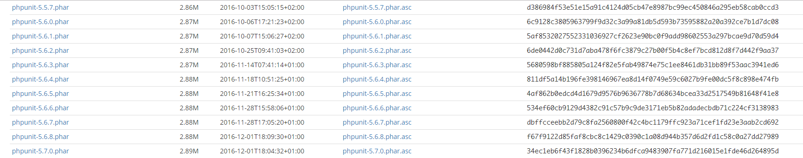

# Phpunit 单元测试

## 前言

在多次尝试多次失败，再尝试的情况下，跑通了一个测试demo，参考了一些文章

- http://bayescafe.com/php/getting-started-with-phpunit.html

- http://www.yii-china.com/post/detail/460.html

## 安装

巨坑的安装之路，访问phpunit中文网**http://www.phpunit.cn/**，目前提供三个版本
都有对应支持的PHP版本，一定要对号下载。


然后事情并没有这么简单，所有的下载连接都是**404**


机智的我找到了官网，查看**https://phpunit.de/**

```bash
➜ wget https://phar.phpunit.de/phpunit.phar

➜ chmod +x phpunit.phar

➜ sudo mv phpunit.phar /usr/local/bin/phpunit

➜ phpunit --version
PHPUnit 6.5.0 by Sebastian Bergmann and contributors.
```

下载的版本是最新版本，根据下载的地址，找到了所有的历史版本，**https://phar.phpunit.de/**




由于我使用的是**PHP 5.6.32 (cli) (built: Nov 28 2017 17:52:20)**，我下载了对应的版本

```bash
 # 下载
 ➜ wget https://phar.phpunit.de/phpunit-5.6.2.phar
 # 加权限
 ➜ chmod +x phpunit-5.6.3.phar
 # 移目录
 ➜ mv phpunit-5.6.3.phar /usr/local/bin/phpunit
 # 查看版本
 ➜ phpuint --version
```

## 测试项目

### laravel 

- 安装laravel 5.1 

```bash
➜ composer create-project laravel/laravel your-project-name --prefer-dist "5.1.*"
```

- 执行测试demo

```bash
➜ phpunit tests
```


### yii 

- 安装

```bash
➜ wget https://github.com/yiisoft/yii2/releases/download/2.0.12/yii-basic-app-2.0.12.tgz

➜ tar -zxvf yii-basic-app-2.0.12.tgz
```

- 部署, nginx 文件指向 **basic/web/** 目录


