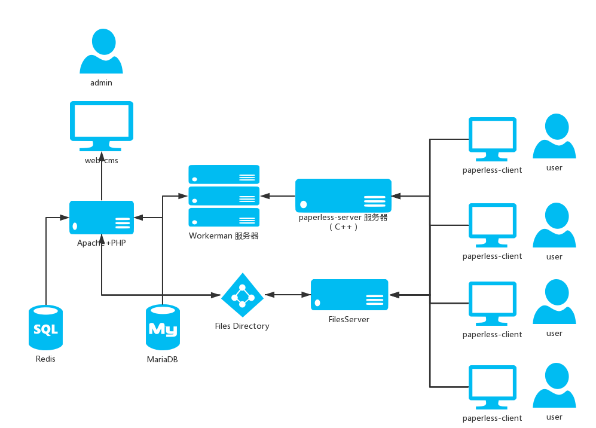
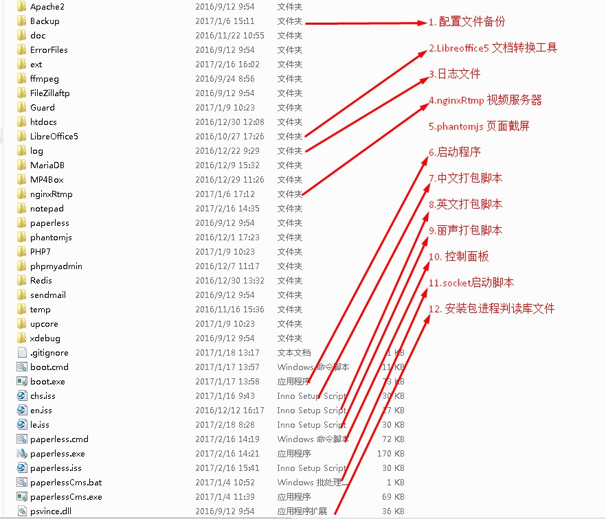

# 无纸化项目

## 基础信息

- 运行环境:windows
- 语言:c++,C#,php,cmd
- 打包工具: inno setup

## 项目结构


## web端运行环境

### 1. 服务器环境 : *UPPUPW* 
- Apache2.4.18
- PHP 7.0.1
- MariaDB 10.1.9
- Redis 2.8.2101

### 2. 文件转换
- soffice 

### 3. 视频转码，直播推流
- ffmpeg
- MP4Box

### 4. 页面截屏
- phantomjs

### 5. 文件编辑器
- notepad++

### 6. socket服务器框架 
- workerman

### 7. 视频服务器
- Nginx-rtmp
- Red5

### 8.前端插件
- layer
- moment.js
- jquery
- highcharts
- jwplayer
- gridstack.js
- easyui

## web 项目目录结构

```
/ 根目录
   └─ webapp ------------------------------------------ 项目目录
       ├─ Application --------------------------------- 应用目录
       |   ├─ _ --------------------------------------- 应用公共模块
       |   |   ├─ Controller -------------------------- 公共控制器
       |   |   └─ Model ------------------------------- 公共模型
       |   ├─ b --------------------------------------- web后台管理模块
       |   |   ├─ Controller -------------------------- 模块控制器目录
       |   |   ├─ Model ------------------------------- 模块模型目录
       |   |   └─ _View ------------------------------- 模块视图文件目录
       ├─ Resource ------------------------------------ 资源文件目录
       |   ├─ _ --------------------------------------- 项目使用js、css目录
       |   ├─ font ------------------------------------ 会议铭牌字体目录
       |   ├─ image ----------------------------------- 项目图片文件目录
       |   ├─ js -------------------------------------- js插件文件目录
       |   ├─ sql ------------------------------------- 数据库sql文件目录
       |   ├─ template -------------------------------- 模板文件目录
       |   ├─ index.php ------------------------------- 入口文件
       |   ├─ .htaccess ------------------------------- apache 分布式配置文件
       |   ├─ favicon.ico ----------------------------- 项目图标文件
       |   └─ key.token ------------------------------- 注册文件
       ├─ Library ------------------------------------ 服务目录
       |   ├─ Applications --------------------------- socket业务逻辑目录
       |   ├─ GatewayWorker -------------------------- Gateway核心文目录
       |   ├─ Workerman ------------------------------ workman核心文目录
       |   ├─ ext ------------------------------------ 扩展目录
       |   ├─ config.ini ----------------------------- 配置文件
       |   ├─ framework.php -------------------------- 核心框架文件
       |   ├─ function.php --------------------------- 公共函数
       |   ├─ getSwitch.php -------------------------- 指令处理文件
       |   ├─ rasterize.js --------------------------- phantomjs文件
       |   └─ mysql.php ------------------------------ 数据库操作核心类
       |   └─ socket.php ----------------------------- socket文件
 
```

## 其他

### 工具及文档


### 1. web运行环境（upupw.zip解压后）

