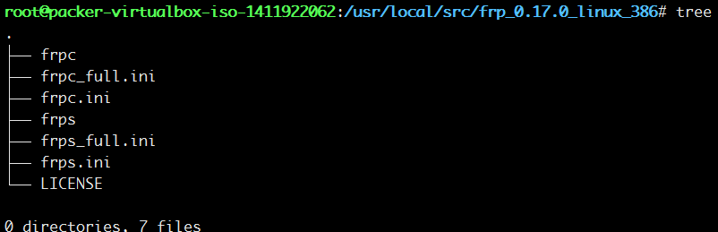
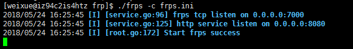
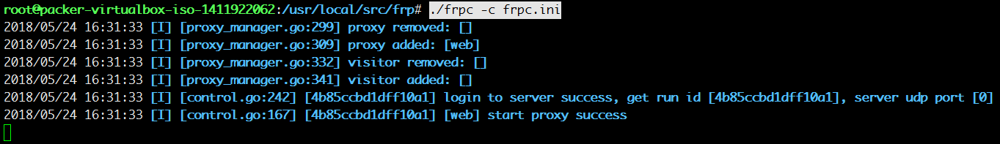
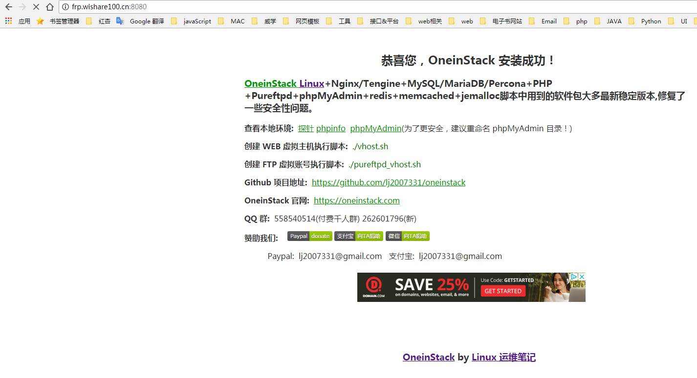

# FRP

## 声明
本教程使用frp_0.17，各个版本下载地址[github](https://github.com/fatedier/frp/releases)

## 下载

- 分系统下载

window 
```
https://github.com/fatedier/frp/releases/download/v0.17.0/frp_0.17.0_windows_386.zip
```
Linux


```
https://github.com/fatedier/frp/releases/download/v0.17.0/frp_0.17.0_linux_386.tar.gz
```

- 解压文件

```
tar -zxvf frp_0.17.0_linux_386.tar.gz

cd frp_0.17.0_linux_386
```



## 服务端 Service

- 开发端口 `7000`和`8080`

- 配置二级域名指向服务器

```
frp.wishare100.cn    120.24.6.236
```

- 修改文件 `frps.ini`

```
[common]
bind_port = 7000
vhost_http_port = 8080
```

- 执行

```
./frps -c frps.ini
```



## 客户端 Client

- 修改配置文件frpc.ini

```
server_addr = 120.24.6.236
server_port = 7000

[web]
type = http
local_port = 80
custom_domains = frp.wishare100.cn 
```

- 执行

```
./frpc -c frpc.ini
```

- 连接成功




## 测试访问

使用`http://frp.wishare100.cn:8080`,成功访问本地项目




