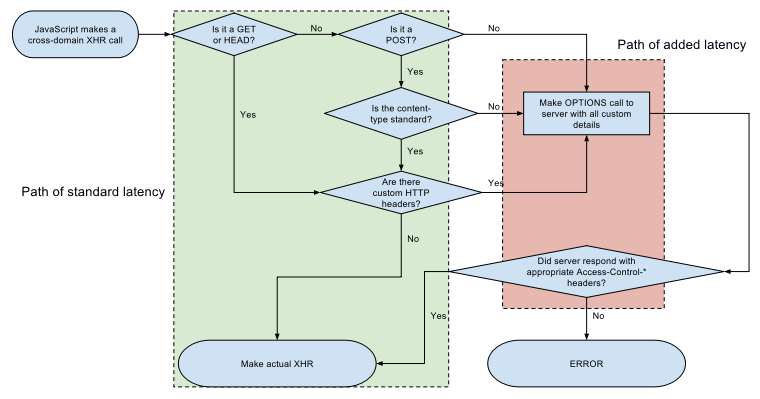

# http

## 请求头

## 响应头

## 常见问题

### 跨域共享，option请求

- 流程


- 跨域定义

> 浏览器从一个域名的网页去请求另一个域名的资源时，域名、端口、协议任一不同，都是跨域

- option请求

> 在正式跨域的请求前，浏览器会根据需要，发起一个“PreFlight”（也就是Option请求），
> 用来让服务端返回允许的方法（如get、post），被跨域访问的Origin（来源，或者域），
> 还有是否需要Credentials(认证信息） 三种场景：

```
1. 如果跨域的请求是Simple Request（简单请求 ），则不会触发“PreFlight”。 Mozilla对于简单请求的要求是： 以下三项必须都成立：

2. 只能是Get、Head、Post方法

3. 除了浏览器自己在Http头上加的信息（如Connection、User-Agent），开发者只能加这几个：Accept、Accept-Language、Content-Type、。。。。

4. Content-Type只能取这几个值： application/x-www-form-urlencoded multipart/form-data text/plain
```

- 总结 

> XHR对象对于HTTP跨域请求有三种：简单请求、Preflighted 请求、Preflighted 认证请求。
> 简单请求不需要发送OPTIONS嗅探请求，但只能按发送简单的GET、HEAD或POST请求，
> 且不能自定义HTTP Headers。Preflighted 请求和认证请求，XHR会首先发送一个OPTIONS嗅探请求，
> 然后XHR会根据OPTIONS请求返回的Access-Control-*等头信息判断是否有对指定站点的访问权限，
> 并最终决定是否发送实际请求信息。 那么我的get请求呢？ 
> 原来，产生 OPTIONS 请求的原因是：自定义 Headers 头信息导致的。 
> 浏览器会去向 Server 端发送一个 OPTIONS 请求，
> 看 Server 返回的 "Access-Control-Allow-Headers" 
> 是否有自定义的 header 字段。因为我之前没有返回自定义的字段，
> 所以，默认是不允许的，造成了客户端没办法拿到数据。

[引用:一次跨域请求出现 OPTIONS 请求的问题及解决方法](https://www.cnblogs.com/xiaozengzeng/p/10852224.html)

[CORS 跨域中的 preflight 请求](https://blog.csdn.net/u012207345/article/details/81449683)