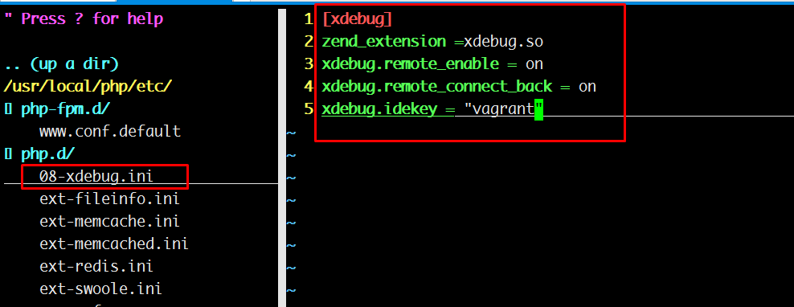
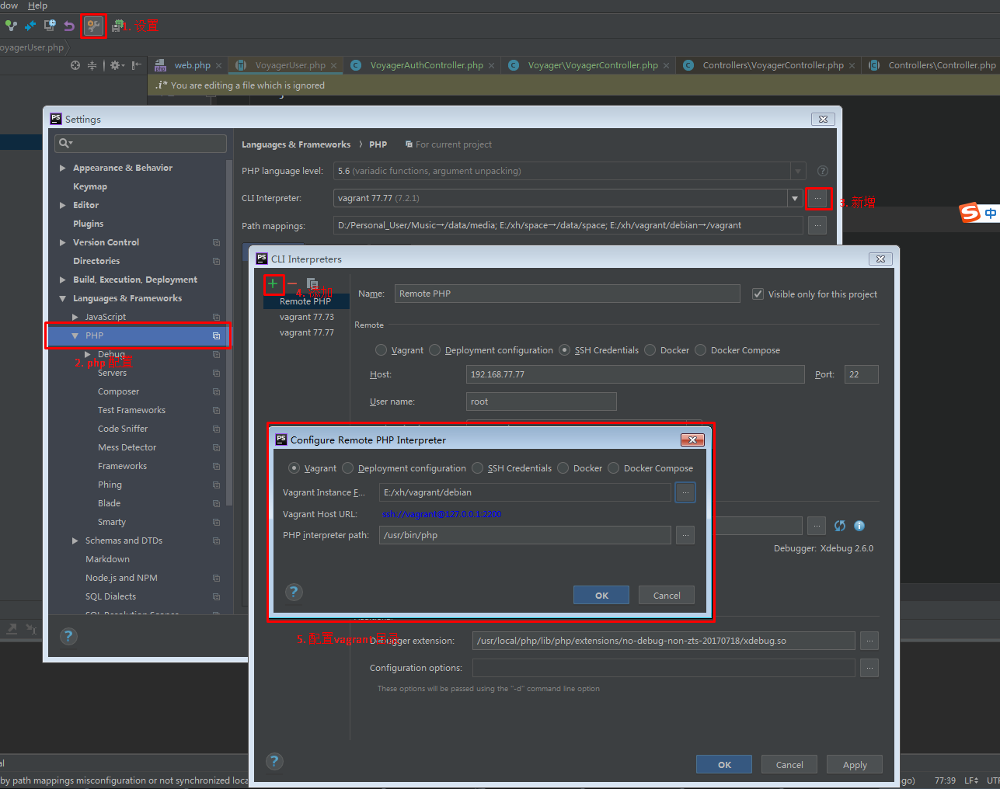
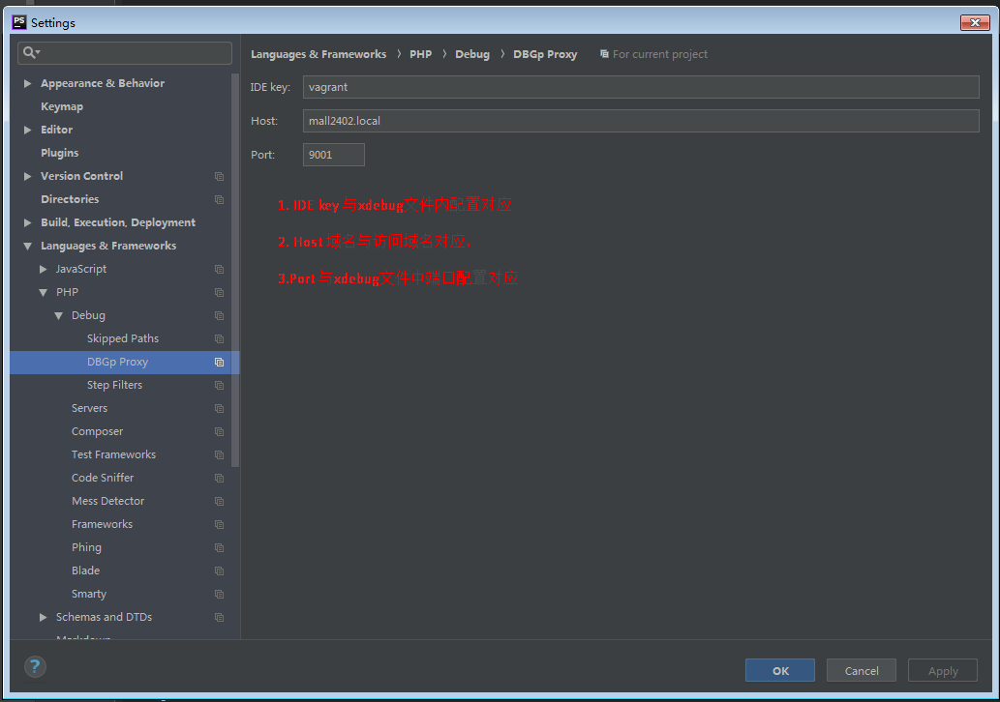
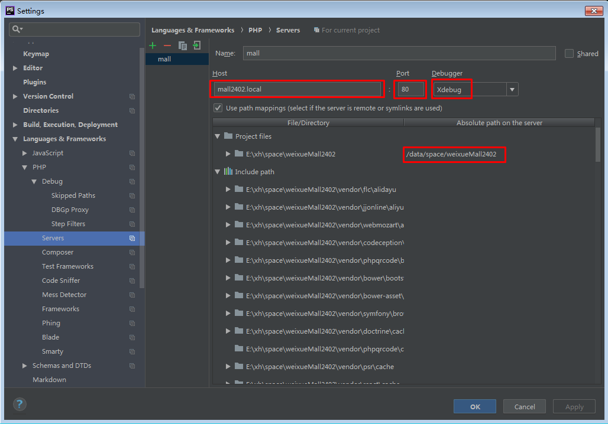

# xdebug配置

## 安装xdebug

## phpstorm.vagrant.debug

- 配置xdebug

```ini
zend_extension =xdebug.so
xdebug.remote_enable = on
xdebug.remote_connect_back = on
xdebug.idekey = "vagrant"
```



- 配置PHP interpreter



- 配置phpstorm debug



- 配置Server




## 